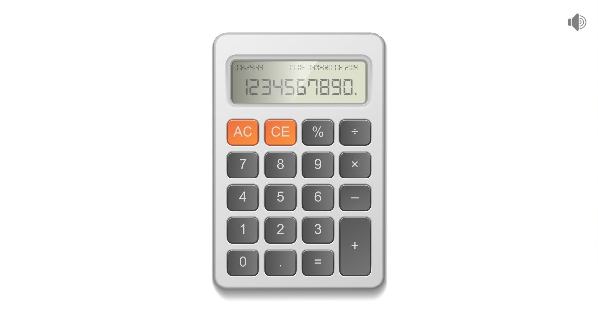
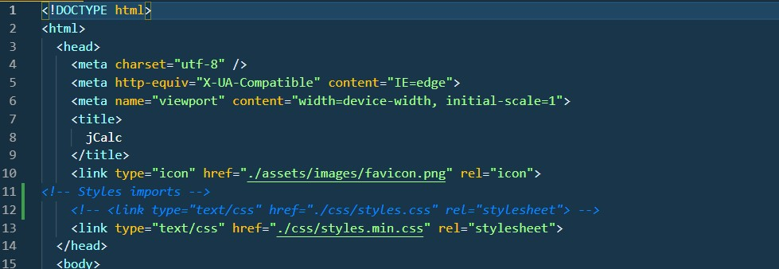
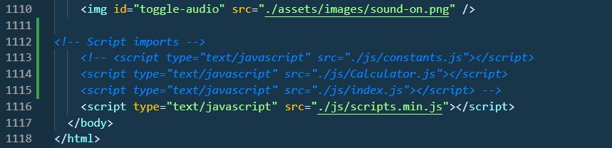

# jCalc

- **JavaScript developed by:** [Julio L. Muller](https://github.com/juliolmuller)
- **HTML & CSS delivered by:** [Hcode Treinamentos](https://www.hcode.com.br)
- **Released on:** Jan 17, 2019
- **Updated on:** Sep 3, 2019
- **Latest version:** 1.1.2
- **License:** MIT

## Overview

Application developed to work as a fully functional pocket calculator. It is part of my personal portfolio of JavaScript projects.

## Run Application

Take a look at this application running through [this link](https://juliolmuller.github.io/jcalc/).

## Resources

- Traditional calculations with `+`, `-`, `*`, `/` and also `%`;
- Continuous calculations by pressing `=` repeatedly;
- Support to 1 or 2 inputs only in the operation;
- Adjustment of the number to 10-digits maximum on the display;
- Errors throwing on division by zero and number over 10 integer digits;
- Sounds on typing (with icon for enabling/disabling); and
- Keyboard input compatibility:
  - `0` trhu `9` to enter numbers
  - `+`, `-`, `*`, `/` and `%` to add operators
  - `.` or `,` to enter decimal separator
  - `Enter` to get the result (`=` sign)
  - `Backspace` to CE (clear current entry)
  - `Escape` to AC (clear all operation)
- Copy (`Ctrl+C`) & Paste (`Ctrl+V`) support;

## Notes

The HTML file ***index.html***, in the **app** folder, is set up to work with the minified transpiled files. Therefore, if you want to work with the development files, comment the *.min* files in the linked style sheets (tags `link`) and imported JavaScript (tags `script`), and uncomment those that are disabled.

The figures below show how you are going to find the HTML file:

